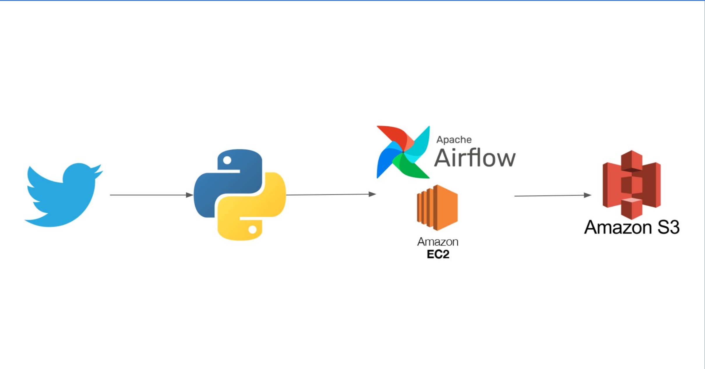

# Rights-Gated Style Fine-Tuning Pipeline

This repository now contains an implementation-ready pipeline for building a short-form writing
style model while preserving raw data, enforcing data-rights approval, measuring memorization, and
preventing deceptive impersonation.

The original Twitter ETL notebook remains as a legacy prototype. It is **not** used by the new
training pipeline and must not be used to collect X content for ML training without appropriate
authorization.

## Implemented components

- Fail-closed JSON rights manifest and separate curated-dataset quality approval.
- CSV/JSON/JSONL ingestion with a lossless raw envelope and canonical normalized schema.
- Retweet/link/language filters, exact deduplication, MinHash-LSH near-duplicate clustering, and
  conversation-aware temporal splitting.
- Private S3 publication that refuses non-empty prefixes, encrypts objects, and publishes the
  dataset manifest last.
- Prompt/completion JSONL output for Hugging Face TRL.
- Qwen2.5-7B-Instruct QLoRA config and a CUDA training entrypoint with lazy optional imports.
- Stylometry, distinct-n, exact-copy, token-span, and 5-gram overlap evaluation.
- FastAPI service with API-key authentication, mandatory synthetic disclosure, request policy,
  identity-output filtering, and training-overlap filtering.
- Standard-library unit/integration tests using self-authored fictional fixtures.

## Current release status

The software pipeline is runnable on synthetic data. Real-corpus training is intentionally blocked
until all of the following exist:

1. `data_rights_manifest.json` is reviewed and approves `dataset_build` and `ml_training` for the
   intended scope.
2. The corpus is supplied outside Git and its source hashes/provenance are recorded.
3. A quality approval matching the built `dataset_id` documents sampled label QA.
4. The optional CUDA training dependencies are installed on a compatible GPU host.

See [DATA_USE.md](docs/DATA_USE.md) and the
[implementation runbook](docs/implementation_runbook.md) before using a real corpus.

## Quick verification

PowerShell:

```powershell
$env:PYTHONPATH = "src"
python -m unittest discover -s tests -v
python -m style_finetuning.cli rights `
  --manifest tests/fixtures/synthetic_rights_manifest.json `
  --use dataset_build `
  --scope test
```

Build the deterministic synthetic dataset into a new directory:

```powershell
$env:PYTHONPATH = "src"
python -m style_finetuning.cli build `
  --input tests/fixtures/synthetic_posts.jsonl `
  --output outputs/synthetic-v1 `
  --config configs/data/default.toml `
  --rights-manifest tests/fixtures/synthetic_rights_manifest.json `
  --scope test
```

## Project layout

```text
configs/                 Data, training, evaluation, and approval templates
dags/                    Airflow orchestration for dataset builds
docs/                    Plan, data-use status, cards, and operating runbook
src/style_finetuning/    Rights, data prep, training, evaluation, and serving code
tests/                   Synthetic fixtures and automated tests
notebooks/               Legacy Twitter ETL prototype
```

## Safety boundary

The service generates labeled synthetic writing only. It does not auto-post, does not expose a
switch to remove disclosure, and blocks explicit impersonation, fabricated official attribution,
targeted political persuasion, and outputs too similar to training examples.

---

## Legacy Twitter ETL Pipeline

A data engineering project that extracts Twitter data using the Twitter API, processes it with Apache Airflow, and stores the results in Amazon S3.

## Architecture Overview



```
Twitter API → Python ETL → Apache Airflow (EC2) → Amazon S3
```

This pipeline extracts tweets from Elon Musk's Twitter account, processes the data, and stores it in a structured format for analysis.

## Features

- **Automated Data Extraction**: Fetches up to 200 recent tweets from @elonmusk
- **Data Processing**: Cleans and structures tweet data including text, engagement metrics, and timestamps
- **Scheduled Execution**: Daily automated runs using Apache Airflow
- **Cloud Storage**: Results stored in Amazon S3 for scalability and accessibility
- **Retweet Filtering**: Excludes retweets to focus on original content

## Tech Stack

- **Python 3.x**
- **Apache Airflow** - Workflow orchestration
- **Tweepy** - Twitter API client
- **Pandas** - Data manipulation and analysis
- **Amazon EC2** - Compute infrastructure
- **Amazon S3** - Data storage
- **s3fs** - S3 filesystem interface

## Prerequisites

### AWS Setup
- AWS account with EC2 and S3 access
- EC2 instance configured and running
- S3 bucket created for data storage
- Proper IAM roles and permissions

### Twitter API Access
- Twitter Developer Account
- Twitter API v1.1 access
- API keys and tokens:
  - Consumer Key
  - Consumer Secret
  - Access Token
  - Access Token Secret

### Python Dependencies
```bash
pip install tweepy pandas s3fs apache-airflow
```

## Installation & Setup

### 1. Clone the Repository
```bash
git clone https://github.com/atulpandey02/airflow-ec2-twitter-to-s3
cd airflow-ec2-twitter-to-s3
```

### 2. Configure Twitter API Credentials
Edit `notebooks/twitter_etl.py` and add your Twitter API credentials:
```python
access_key = "your_access_key_here" 
access_secret = "your_access_secret_here" 
consumer_key = "your_consumer_key_here"
consumer_secret = "your_consumer_secret_here"
```

### 3. Setup Apache Airflow on EC2
```bash
# Initialize Airflow database
airflow db init

# Create admin user
airflow users create \
    --username admin \
    --firstname Admin \
    --lastname User \
    --role Admin \
    --email admin@example.com

# Copy DAG files to Airflow directory
cp notebooks/twitter_dag.py ~/airflow/dags/
cp notebooks/twitter_etl.py ~/airflow/dags/
```

### 4. Start Airflow Services
```bash
# Start the web server (in one terminal)
airflow webserver --port 8080

# Start the scheduler (in another terminal)
airflow scheduler
```

## Project Structure

```
airflow-ec2-twitter-to-s3/
│
├── docs/
│   ├── .gitkeep
│   └── twitter_commands.sh    # Setup and deployment commands
├── images/
│   ├── .gitkeep
│   └── architecture.png       # Architecture diagram
├── notebooks/
│   ├── .gitkeep
│   ├── twitter_dag.py         # Airflow DAG configuration
│   └── twitter_etl.py         # Main ETL logic
├── .gitignore                 # Git ignore rules
├── LICENSE                    # Project license
└── README.md                  # Project documentation
```

## File Descriptions

### `notebooks/twitter_etl.py`
Contains the main ETL function that:
- Authenticates with Twitter API using OAuth
- Fetches tweets from @elonmusk timeline
- Extracts relevant fields (text, engagement metrics, timestamps)
- Saves processed data to CSV format

### `notebooks/twitter_dag.py`
Defines the Airflow DAG with:
- Daily execution schedule
- Error handling and retry logic
- Task dependencies and workflow structure

### `docs/twitter_commands.sh`
Contains setup and deployment commands for:
- EC2 instance configuration
- Airflow installation and setup
- Environment configuration scripts

## Data Schema

The extracted data includes the following fields:

| Field | Description | Type |
|-------|-------------|------|
| user | Twitter username | String |
| text | Tweet content (full text) | String |
| favorite_count | Number of likes | Integer |
| retweet_count | Number of retweets | Integer |
| created_at | Tweet timestamp | Datetime |

## Usage

### Manual Execution
```python
from notebooks.twitter_etl import run_twitter_etl
run_twitter_etl()
```

### Airflow Web Interface
1. Access Airflow UI at `http://your-ec2-instance:8080`
2. Login with admin credentials
3. Enable the `twitter_dag`
4. Monitor execution in the dashboard

### Scheduled Execution
The DAG is configured to run daily at midnight. You can modify the schedule in `notebooks/twitter_dag.py`:
```python
schedule_interval=timedelta(days=1)  # Modify as needed
```

## Configuration Options

### Modifying Tweet Count
Change the number of tweets extracted (max 200):
```python
tweets = api.user_timeline(screen_name='@elonmusk', count=50)  # Fetch 50 tweets
```

### Changing Target User
Extract tweets from different users:
```python
tweets = api.user_timeline(screen_name='@username', count=200)
```

### Including Retweets
To include retweets in the data:
```python
tweets = api.user_timeline(screen_name='@elonmusk', 
                          count=200,
                          include_rts=True)  # Set to True
```

## Monitoring & Troubleshooting

### Airflow Logs
Monitor task execution through Airflow UI:
- Navigate to DAG → Task Instances → Logs
- Check for API rate limits or authentication errors

### Common Issues
- **API Rate Limits**: Twitter API has rate limits (300 requests per 15-minute window)
- **Authentication Errors**: Verify API credentials are correct and active
- **EC2 Permissions**: Ensure EC2 has proper IAM roles for S3 access

## Security Considerations

- **Never commit API keys**: Use environment variables or AWS Secrets Manager
- **EC2 Security Groups**: Restrict access to necessary ports only
- **S3 Bucket Policies**: Implement least-privilege access principles

## Future Enhancements

- [ ] Add S3 upload functionality (currently saves to local CSV)
- [ ] Implement data validation and error handling
- [ ] Add support for multiple Twitter accounts
- [ ] Create data quality checks and monitoring
- [ ] Add sentiment analysis processing
- [ ] Implement incremental data loading

## Cost Optimization

- Use EC2 spot instances for cost savings
- Implement S3 lifecycle policies for data archiving
- Monitor and optimize Airflow resource usage

## Contributing

1. Fork the repository
2. Create a feature branch (`git checkout -b feature/new-feature`)
3. Commit your changes (`git commit -am 'Add new feature'`)
4. Push to the branch (`git push origin feature/new-feature`)
5. Create a Pull Request

## License

This project is licensed under the MIT License - see the LICENSE file for details.

## Acknowledgments

- Twitter API for providing access to tweet data
- Apache Airflow community for the excellent orchestration platform
- AWS for reliable cloud infrastructure

---

**Note**: This project is for educational and research purposes. Please comply with Twitter's API terms of service and rate limiting guidelines.
